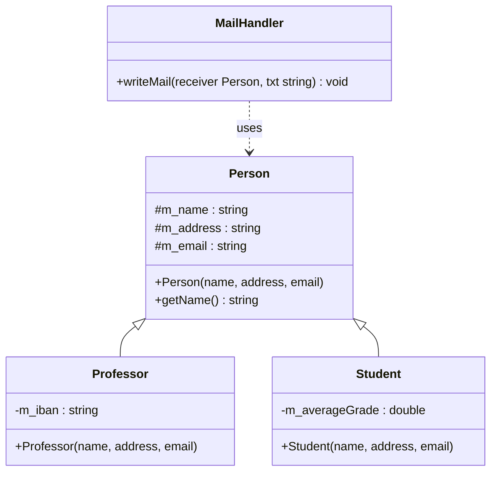

# Aufgabe: Vererbung – Person, Professor, Student & MailHandler

## Beschreibung

In dieser Aufgabe soll ein kleines Klassenmodell in C++ implementiert werden, das **einfache Vererbung** demonstriert. Grundlage ist das folgende UML-Diagramm.

Keine der Member-Variablen der Klassen darf `public` sein. Falls auf eine Member-Variable von außen zugegriffen werden muss, ist ein **Getter** zu implementieren.

Die Implementierung soll auf **mehrere Dateien** aufgeteilt werden (`.hpp` + `.cpp` je Klasse).

## UML-Diagramm



## Anforderungen

### Klasse `Person`
- Protected Member: `m_name`, `m_address`, `m_email` (alle `std::string`)
- Konstruktor mit `name`, `address`, `email`
- Getter `getName()` – wird von `MailHandler` benötigt

### Klasse `Professor` (erbt von `Person`)
- Zusätzlicher privater Member: `m_iban` (`std::string`)
- Konstruktor mit `name`, `address`, `email`

### Klasse `Student` (erbt von `Person`)
- Zusätzlicher privater Member: `m_averageGrade` (`double`)
- Konstruktor mit `name`, `address`, `email`

### Klasse `MailHandler`
- Methode `writeMail(Person receiver, std::string mailText)` – gibt Empfänger und Mailtext auf der Konsole aus

## Vorgehen

1. Erstellen Sie für jede Klasse eine `.hpp`- und eine `.cpp`-Datei mit Include Guard.
2. Implementieren Sie zunächst `Person` als Basisklasse.
3. Leiten Sie `Professor` und `Student` von `Person` ab.
4. Implementieren Sie `MailHandler` unabhängig davon.
5. Testen Sie die Implementierung in `main.cpp` mit Aufrufen wie im Beispiel.

## Beispielablauf

```cpp
Person Frank("Frank", "Hellweg 3", "frank@web.de");
Professor Nina("Nina", "Sofienstraße 1", "nina@web.de");
Student Kai("Kai", "Tollweg 12", "kai@web.de");

MailHandler myMailHandler;
myMailHandler.writeMail(Frank, "Hallo Frank, wie geht es dir?");
myMailHandler.writeMail(Nina, "gut, und dir?");
myMailHandler.writeMail(Kai, "Hi :)");
```

Erwartete Ausgabe (Beispiel):
```
Mail to Frank: Hallo Frank, wie geht es dir?
Mail to Nina: gut, und dir?
Mail to Kai: Hi :)
```

## Bewertungskriterien

- **Funktionalität**: Kann das Programm fehlerfrei gebaut und ausgeführt werden?
- **Vererbung**: Erben `Professor` und `Student` korrekt von `Person`?
- **Kapselung**: Sind alle Member-Variablen nicht-`public` und Zugriffe nur über Getter?
- **Dateistruktur**: Sind Header und Implementierung sauber getrennt, mit Include Guards?
- **Code-Qualität**: Ist der Code sauber, verständlich und entspricht den Coding Conventions?
